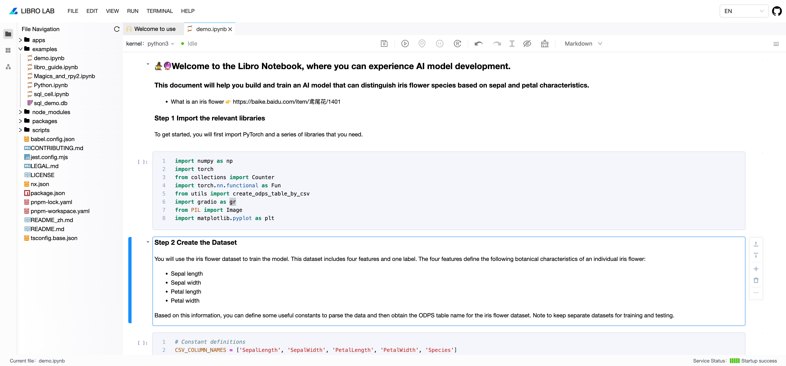
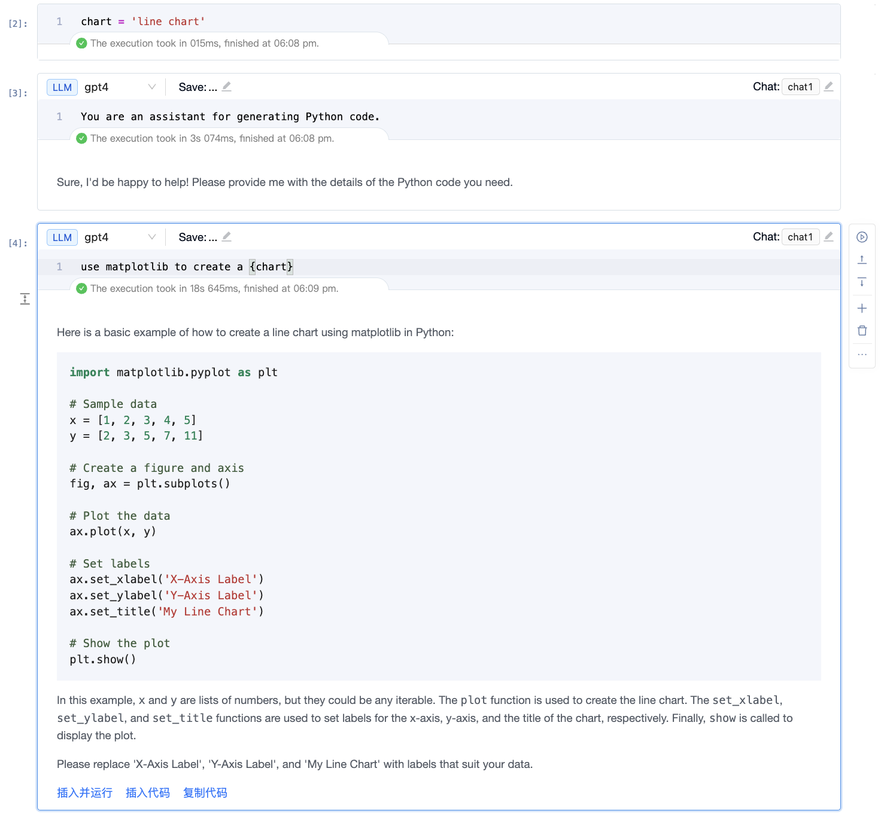
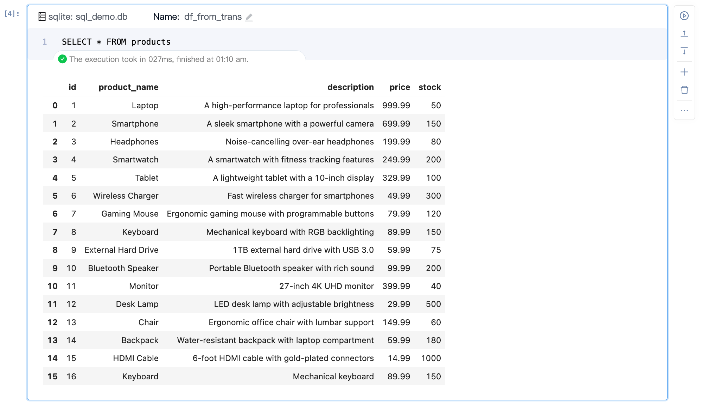

Language: English | [简体中文](./README_zh.md)

<p align="center"></p>
<p align="center"><strong>A Notebook Product Solution with Flexible Customization and Easy Integration</strong></p>

<p align="center">
<a href="https://github.com/difizen/libro/actions/workflows/ci.yml"></a>
<a href="/LICENSE"></a>
<a href="https://www.npmjs.com/package/@difizen/libro-core"></a>
<a href="https://github.com/difizen/libro/pulls"></a>
<a href="https://libro.difizen.net"></a>
</p>

## Features

- Provides comprehensive Notebook functionality with a rich set of auxiliary tools, allowing for quick adoption based on existing setups.
- Supports kernel-level extensibility, enabling customization and further development at all layers.
- Defines workflows for large models, with built-in capabilities for model interaction and AI-powered assistance.

<p>　</p>
<p align="center">
🌟🌟🌟 If you like this project, feel free to give us a star! 🌟🌟🌟
</p>
<p>　</p>



---

## Table of Contents

- [Quick Start](#Quick-Start)
- [Quick Integration](#Quick-Integration)
- [New Features](#New-Features)
  - [prompt cell](#prompt-cell)
  - [sql cell](#sql-cell)
- [Technical Architecture](#Technical-Architecture)
- [Future Plans](#Future-Plans)
- [More](#More)
  - [Reporting Issues](#Reporting-Issues)
  - [Contributing](#Contributing)
  - [Contributors](#Contributors)
  - [Contact Us](#Contact-Us)

---

## Quick Start

You need to install [libro-server](https://github.com/difizen/libro-server) to fully explore the capabilities of libro.

use pip:

```bash
pip install libro
```

For more details, please refer to [quick start](./apps/docs/docs/quickstart/index.md)。

## Quick Integration

libro is fully modular, giving you the flexibility to choose from its native capability modules or add custom ones for extended development. To learn more about the modular development approach, check out [mana](https://github.com/difizen/mana).

You can assemble different modules based on your needs to build your own notebook product. For example, you might integrate only the editor-related modules into an IDE or other development environments, or bring in more modules to create a lab-style solution.

You need to install at least jupyter-server to run libro, which will give you access to the features of Jupyter Notebook. If you want to leverage the additional capabilities defined by libro, you'll need to install libro-server.

For more details, please refer to [quick integration](./apps/docs/docs/integration/index.md)。

### Component-Based Consumption

```typescript
import { ManaComponents } from '@difizen/mana-app';
import { LibroJupyterModule } from "@difizen/libro-jupyter";

<ManaComponents.Application
  modules={[LibroJupyterModule]}
  renderChildren
>
  <LibroComponent options={{ id: 'identify' }} />
</ManaComponents.Application>
```

- Application： The mana context container, which is recommended to be placed at the outer layer of the application, allowing multiple libro instances to share the context.
- LibroComponent：The libro view component, which allows you to embed the libro view anywhere.

## New Features

### Prompt Cell

- Enhances the ability to interact directly with large models, supporting text conversations, multimodal expressions, and more.
- Improves interaction capabilities for common output types, such as providing options to copy or run code when outputting it.

  

### Sql Cell

- Supports interaction capabilities for executing SQL commands.
- Connect to SQL databases to write SQL code directly in the notebook.

  

## Technical Architecture


## Future Plans

- SQL Cell Integration
- AI Capability Integration
- Support for Prompt Notebook
- Execution of libro in the Browser

## More

### Reporting Issues

😊 We recommend submitting your questions through [github issue](https://github.com/difizen/libro/issues), and we typically respond within two days.

### Contributing

🤝 Please refer to [CONTRIBUTING.md](./CONTRIBUTING.md)

### Contributors

💪 Thanks to all contributors

<a href="https://github.com/difizen/libro/graphs/contributors">
  
</a>

### Contact Us

💬 [Chat with us on Discord](https://discord.gg/RbZ9aEKK)

🤗 [Join our DingTalk Q&A group](https://qr.dingtalk.com/action/joingroup?code=v1,k1,52f1gKWwsZBMrWjXHcQFlOJEQIbbrMO86Iulu3T3ePY=&_dt_no_comment=1&origin=11)


