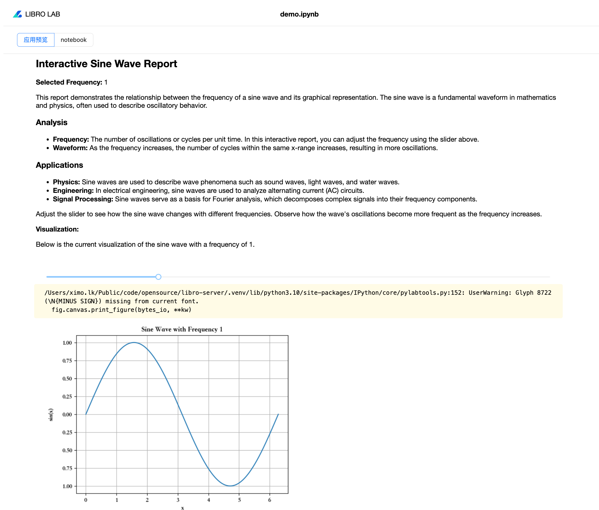

# 概述

在数据分析和报告制作中，libro 提供了一种创新的工作方式。当我们在 libro 中使用 SQL Cell 和 Python Cell 完成数据处理后，可以通过隐藏 notebook 的输入部分，仅展示 Markdown 文本和输出结果，将 notebook 轻松转换为一份完整的、结构化的报告。这样一来，不仅保证了分析过程的可追溯性，还能以简洁的视觉效果呈现结果，提供清晰、专业的分析报告。

