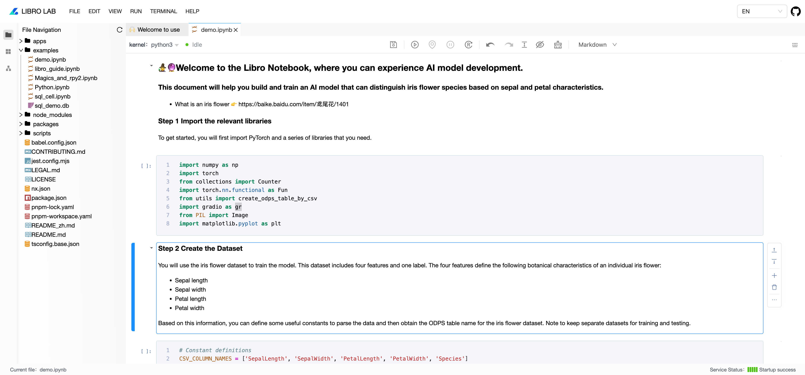

# Overview

Libro offers customizable integration capabilities for both frontend and server-side applications. This guide will walk you through the steps to quickly customize and integrate Libro.

# Frontend Project Integration

## Umi Project Integration

Before starting, ensure your local environment has Node version 18 or above installed.

### Install Dependencies

Install the relevant packages for libro and mana as needed.

```bash
pnpm add @difizen/libro-lab // Install for lab development environment integration
pnpm add @difizen/libro-jupyter // Install for libro editor integration
pnpm add @difizen/mana-app

pnpm add @difizen/umi-plugin-mana -D
```

### Update Configuration

1. Add the mana-related configuration for libro’s underlying dependency framework in `.umirc.ts`.

```typescript
export default defineConfig({
  // Import the plugin
  plugins: ['@difizen/umi-plugin-mana'],
  // Configuration
  mana: {
    decorator: true,
    nodenext: true,
    routerBase: true,
    runtime: true,
  },
});
```

In the `tsconfig.json` file at the project root, add the following configuration to address some compile-time errors from mana, libro's underlying dependency framework.

```json
"compilerOptions": {
  "strictPropertyInitialization": false,
  "experimentalDecorators": true,
},
```

### Integrate Lab Development Environment



1. Connect to the Notebook Service: You can do this by installing `libro-server` or by using Jupyter’s functionality, such as Jupyter server or Jupyter lab. Start the service, obtain the corresponding service link, and update the link on the frontend as follows:

```typescript
import { ServerConnection, ServerManager } from '@difizen/libro-lab';
import { ApplicationContribution, inject, singleton } from '@difizen/mana-app';

@singleton({ contrib: ApplicationContribution })
export class LibroApp implements ApplicationContribution {
  @inject(ServerConnection) serverConnection: ServerConnection;
  @inject(ServerManager) serverManager: ServerManager;

  async onStart() {
    this.serverConnection.updateSettings({
      baseUrl: 'http://localhost:8888/',
      wsUrl: 'ws://localhost:8888/',
    });
    this.serverManager.launch();
  }
}
```

2. Create and register a `ManaModule`.

```typescript
import { ManaModule } from '@difizen/mana-app';
import { LibroApp } from './app';
import { LibroLabModule } from '@difizen/libro-lab';

export const LabModule = ManaModule.create()
  .register(LibroApp)
  .dependOn(LibroLabModule);
```

3. Implement the `LibroLab` React component. The `ManaComponents.Application` component wraps the mana application, enabling all mana modules to share the same context.

```typescript
import React from 'react';
import { ManaAppPreset, ManaComponents } from '@difizen/mana-app';
import { LabModule } from '@/modules/libro-lab/module';
import './index.less'

const App = (): JSX.Element => {
  return (
    <div className="libro-workbench-app">
      <ManaComponents.Application
        key="libro-lab"
        asChild={true}
        modules={[ManaAppPreset, LabModule]}
      />
    </div>
  );
};

export default App;
```

### Integrate Notebook Editor


1. Create a React component for the Libro editor, using `LibroService` to create a `LibroView` instance and render it through `ViewRender`.

```typescript
import { DocumentCommands, LibroService, LibroView } from '@difizen/libro-jupyter';
import { CommandRegistry, ViewRender, useInject } from '@difizen/mana-app';
import React, { useEffect, useState } from 'react';

export const LibroEditor: React.FC = () => {
  const libroService = useInject<LibroService>(LibroService);
  const [libroView, setLibroView] = useState<LibroView | undefined>();
  const [handle, setHandle] = useState<number | undefined>();
  const commandRegistry = useInject(CommandRegistry);

  const save = () => {
    commandRegistry.executeCommand(
      DocumentCommands['Save'].id,
      undefined,
      libroView,
      undefined,
      { reason: 'autoSave' },
    );
  };

  const doAutoSave = () => {
    const handle = window.setTimeout(() => {
      save();
      if (libroView) {
        libroView.model.dirty = false;
      }
    }, 1000);
    setHandle(handle);
  }

  useEffect(() => {
    libroService.getOrCreateView().then((libro) => {
      if (!libro) return;
      setLibroView(libro);
      libro.model.onChanged(() => {
        doAutoSave();
      });
    });

    return () => {
      window.clearTimeout(handle);
    }
  }, []);

  return (
    <div className="libro-editor-container">
      {libroView && <ViewRender view={libroView} />}
    </div>
  );
};
```

2. Configure the editor's data source. For more details, see the documentation.

```typescript
import type {
  IContentsModel,
  INotebookContent,
  LibroJupyterModel,
  NotebookOption,
} from '@difizen/libro-jupyter';
import { ContentContribution } from '@difizen/libro-jupyter';
import { singleton } from '@difizen/mana-app';

@singleton({ contrib: ContentContribution })
export class LibroEditorContentContribution implements ContentContribution {
  canHandle = () => 10;

  async loadContent(options: NotebookOption, model: LibroJupyterModel) {
    const notebookContent: INotebookContent = require('./libro-demo.json');
    const currentFileContents: IContentsModel = {
      name: 'libro-demo.ipynb',
      path: '/libro-demo.ipynb',
      type: 'notebook',
      writable: true,
      created: 'libro',
      last_modified: 'libro',
      content: notebookContent,
    };
    currentFileContents.content.nbformat_minor = 5;
    model.currentFileContents = currentFileContents;
    model.filePath = currentFileContents.path;
    model.lastModified = model.currentFileContents.last_modified;
    if (model.executable) {
      model.startKernelConnection();
    }
    return notebookContent;
  }
}
```

3. Create and register a `mana` module.

```typescript
import { ManaModule } from '@difizen/mana-app';
import { LibroApp } from './app';
import { LibroJupyterModule } from '@difizen/libro-lab';
import { LibroEditorContentContribution } from './libro-content-contribution';

export const LibroEditorModule = ManaModule.create()
  .register(LibroApp, LibroEditorContentContribution)
  .dependOn(LibroJupyterModule);
```

4. Use the `LibroEditor` React component. Wrap it with `ManaComponents.Application` to enable shared context for multiple `LibroView` instances.

> Note: Add `renderChildren` to render the children components within `ManaComponents.Application`.

```typescript
import React from 'react';
import { ManaAppPreset, ManaComponents } from '@difizen/mana-app';
import './index.less';
import { LibroEditorModule } from '@/modules/libro-editor/module';
import { LibroEditor } from './libro-editor';

const App = (): JSX.Element => {
  return (
    <div className="libro-editor-demo">
      <ManaComponents.Application
        key="libro-editor"
        modules={[ManaAppPreset, LibroEditorModule]}
        renderChildren
        asChild={true}
      >
        <LibroEditor />
      </ManaComponents.Application>
    </div>
  );
};

export default App;
```
