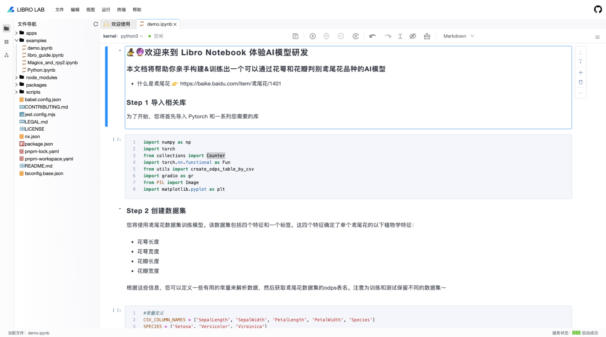
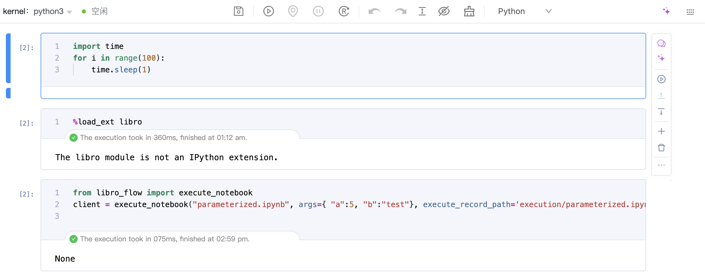

# 概览

Libro 提供了前端和服务侧的定制接入能力，本文将手把手教你快速定制接入。

# 前端项目接入

## Umi 项目接入

在开始运行前，请先保证本地的环境已经安装 node 版本是 18 或以上。

### 安装依赖

安装 libro , mana 相关的依赖包，可按照需要安装。

```bash
pnpm add @difizen/libro-lab //集成 lab 研发环境时安装
pnpm add @difizen/libro-jupyter //集成 libro 编辑器时安装
pnpm add @difizen/mana-app

pnpm add @difizen/umi-plugin-mana -D
```

### 修改配置

1. 在 .umirc.ts 中增加 libro 底层依赖框架 mana 相关的配置。

```typescript
export default defineConfig({
  // 引入
  plugins: ['@difizen/umi-plugin-mana'],
  // 配置
  mana: {
    decorator: true,
    nodenext: true,
    routerBase: true,
    runtime: true,
  },
});
```

在项目根目录中的 tsconfig.json 文件中添加如下配置，从而满足 libro 的底层依赖框架 mana 中的一些编译提示报错。

```json
"compilerOptions": {
  "strictPropertyInitialization": false,
  "experimentalDecorators": true,
},
```

### 集成 Lab 研发环境



1. 连接 Notebook 服务：这里您可以通过安装 libro-server ，也可以使用 jupyter 的能力，例如 jupyter server 或者 jupyter lab。启动服务，获得对应的服务链接，并可以按照下述方式在前端侧更新服务链接。

```typescript
import { ServerConnection, ServerManager } from '@difizen/libro-lab';
import { ApplicationContribution, inject, singleton } from '@difizen/mana-app';

@singleton({ contrib: ApplicationContribution })
export class LibroApp implements ApplicationContribution {
  @inject(ServerConnection) serverConnection: ServerConnection;
  @inject(ServerManager) serverManager: ServerManager;

  async onStart() {
    this.serverConnection.updateSettings({
      baseUrl: 'http://localhost:8888/',
      wsUrl: 'ws://localhost:8888/',
    });
    this.serverManager.launch();
  }
}
```

2. 创建并注册 ManaModule。

```typescript
import { ManaModule } from '@difizen/mana-app';
import { LibroApp } from './app';
import { LibroLabModule } from '@difizen/libro-lab';

export const LabModule = ManaModule.create()
  .register(LibroApp)
  .dependOn(LibroLabModule);
```

3. 通过下述方式实现关于 LibroLab 的 React 组件，其中 ManaComponents.Application 为 mana 应用的react 形式的组件，所有的 mana 模块都注册在该上下文中。

```typescript
import React from 'react';
import { ManaAppPreset, ManaComponents } from '@difizen/mana-app';
import { LabModule } from '@/modules/libro-lab/module';
import './index.less'


const App = (): JSX.Element => {
  return (
    <div className="libro-workbench-app">
      <ManaComponents.Application
        key="libro-lab"
        asChild={true}
        modules={[ManaAppPreset, LabModule]}
      />
    </div>
  );
};

export default App;

```

### 集成 Notebook 编辑器



1. 编写 Libro 编辑器的 React 组件，核心是通过 LibroService 创建 LibroView 实例，并通过 ViewRender 渲染构建出的 LibroView 实例。

```jsx
import { DocumentCommands, LibroService, LibroView } from '@difizen/libro-jupyter';
import { CommandRegistry, ViewRender, useInject } from '@difizen/mana-app';
import React from 'react';
import { useEffect, useState } from 'react';

export const LibroEditor: React.FC = ()=>{
  const libroService = useInject<LibroService>(LibroService);
  const [libroView,setLibroView] = useState<LibroView|undefined>();
  const [handle,setHandle] = useState<number|undefined>();
  const commandRegistry = useInject(CommandRegistry);

  const save = () => {
    //通过命令进行保存
    commandRegistry.executeCommand(
      DocumentCommands['Save'].id,
      undefined,
      libroView,
      undefined,
      { reason: 'autoSave' },
    );
  };

  const doAutoSave = () =>{
    //设置自动保存逻辑
    const handle = window.setTimeout(() => {
      save();
      if (libroView) {
        libroView.model.dirty = false;
      }
    },1000);
    setHandle(handle)
  }

  useEffect(() => {
    libroService.getOrCreateView({
      //这里可以给每个 libro 编辑器增加标识，用于区分每次打开编辑器里面的内容都不一样
    }).then((libro)=>{
      if(!libro) return;
      setLibroView(libro);
      libro.model.onChanged(() => {
        doAutoSave();
      });
    })

    return ()=>{
      window.clearTimeout(handle);
    }
  }, []);

  return (
    <div className='libro-editor-container'>
      {libroView && <ViewRender view={libroView}/>}
    </div>
  );
}
```

2. 设置编辑器数据源，详情参考：todo

```typescript
import type {
  IContentsModel,
  INotebookContent,
  LibroJupyterModel,
  NotebookOption,
} from '@difizen/libro-jupyter';
import { ContentContribution } from '@difizen/libro-jupyter';
import { singleton } from '@difizen/mana-app';

@singleton({ contrib: ContentContribution })
export class LibroEditorContentContribution implements ContentContribution {
  canHandle = () => {
    return 10;
  };

  async loadContent(options: NotebookOption, model: LibroJupyterModel) {
    let notebookContent: INotebookContent = require('./libro-demo.json');
    let currentFileContents: IContentsModel = {
      name: 'libro-demo.ipynb',
      path: '/libro-demo.ipynb',
      type: 'notebook',
      writable: true,
      created: 'libro',
      last_modified: 'libro',
      content: notebookContent,
    };
    currentFileContents.content.nbformat_minor = 5;
    model.currentFileContents = currentFileContents;
    model.filePath = currentFileContents.path;
    model.lastModified = model.currentFileContents.last_modified;
    if (model.executable) {
      model.startKernelConnection();
    }
    return notebookContent;
  }
}
```

3. 创建并注册 mana module。

```typescript
import { ManaModule } from '@difizen/mana-app';
import { LibroApp } from './app';
import { LibroJupyterModule } from '@difizen/libro-lab';
import { LibroEditorContentContribution } from './libro-content-contribution';

export const LibroEditorModule = ManaModule.create()
  .register(LibroApp, LibroEditorContentContribution)
  .dependOn(LibroJupyterModule);
```

4. 消费 Libro 编辑器的 React 组件，在使用 LibroEditor 的最外层包上 ManaComponents.Application ，使得多个 LibroView 的实例可以共享上下文。

注意：由于此时 ManaComponents.Application中包裹了 LibroEditor组件，需要单独增加 renderChildren用于渲染。

```jsx
import React from 'react';
import { ManaAppPreset, ManaComponents } from '@difizen/mana-app';
import './index.less'
import { LibroEditorModule } from '@/modules/libro-editor/module';
import { LibroEditor } from './libro-editor';


const App = (): JSX.Element => {
  return (
    <div className="libro-editor-demo">
      <ManaComponents.Application
        key="libro-editor"
        modules={[ManaAppPreset, LibroEditorModule]}
        renderChildren
        asChild={true}
        >
        <LibroEditor/>
      </ManaComponents.Application>
    </div>
  );
};

export default App;
```
