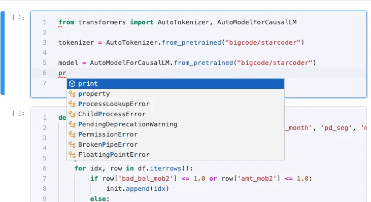

# 编辑器接入 LSP

Libro可以在多种环境运行，当使用Libro-server的模式来部署时，代码编辑器需要一些配置接入LSP来支持高级功能（代码补全、提示、校验、格式化等）。

## 编辑器基本架构



Libro 在编辑器层面提供了[IEditor](https://github.com/difizen/libro/blob/ea46403edaa99488a59b0f94554c22b7115b3d6f/packages/libro-code-editor/src/code-editor-protocol.ts#L207)抽象，来提供代码编辑能力。
代码编辑(python\md\sql等)、全局搜索等场景会依赖`IEditor`接口。IEditor的具体实现有多种，包括code mirror 6、Cofine Editor等。
Cofine Editor基于monaco editor实现，编辑器本身支持丰富的语言服务接口（如代码提示、代码跳转、格式化等）。我们提供了[LibroLanguageClient](https://github.com/difizen/libro/blob/ea46403edaa99488a59b0f94554c22b7115b3d6f/packages/libro-language-client/src/libro-language-client.ts#L29)来对接LSP server，获取语言服务信息。LSP server作为独立进程部署在服务端，由jupyter-lsp进行元数据管理。


## LSP server 配置

LSP server 需要支持LSP协议的Notebook部分的能力，才能在Libro正常工作。当前支持的server包括Ruff和Pylez（之前叫libro-analyzer）。

Ruff LSP server运行在python环境，已在libro-server中自带。
Pylez运行在nodejs环境，需要服务器安装npm和nodejs。使用 `npm install @difizen/libro-analyzer`安装依赖，并在Libro-server配置文件中提供以下配置项：

```python
c.LanguageServerManager.language_servers = {
    "ruff-lsp": {
        # if installed as a binary
        "argv": [
            "ruff-lsp",
        ],
        "languages": ["python"],
        "version": 2,
        "mime_types": ["text/x-python"],
        "display_name": "ruff-lsp",
    },
    "libro-analyzer": {
        # if installed as a binary
        "argv": [
            "node",
            "node_modules/@difizen/libro-analyzer/index.js", # 填写 Libro-analyzer 的实际安装地址
            "--stdio",
        ],
        "languages": ["python"],
        "version": 2,
        "mime_types": ["text/x-python"],
        "display_name": "libro-analyzer",
    },
}
```
