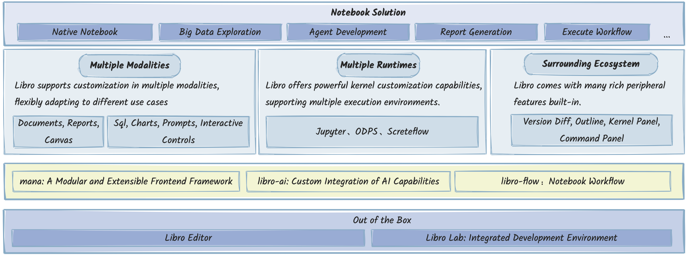
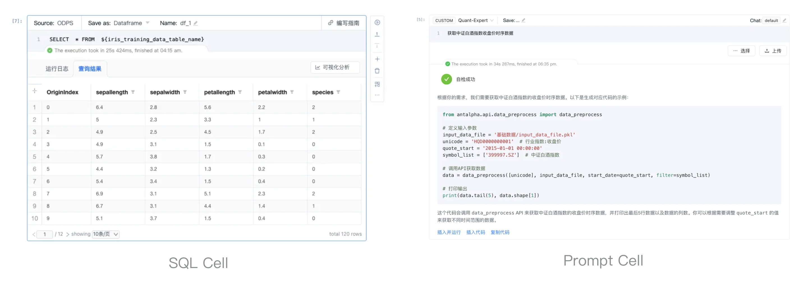
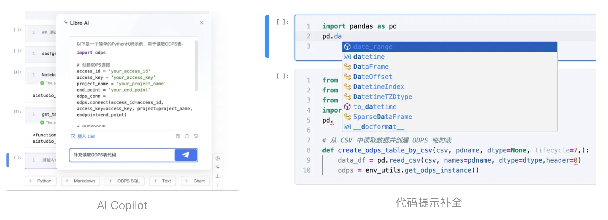
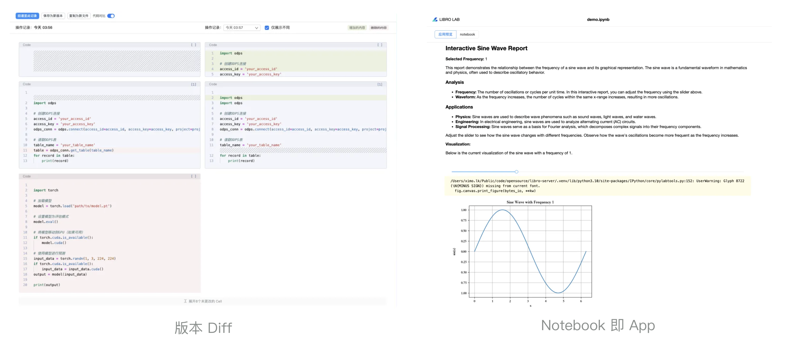

---
nav:
  title: 介绍

title: 介绍
order: 1
---

# 什么是 libro？

libro 是一款致力于提供高度开放集成和定制能力的 notebook 产品方案。它提供超越原生 jupyter 的体验，集成强大的 AI 能力，支持内核级别的扩展，助力开发者轻松定制 notebook 产品，构建一流的 AI、数据科学研发方案。

🌟 GitHub 地址：
https://github.com/difizen/libro

🌟 官网地址：
https://libro.difizen.net/

# 为什么做 libro？

在 AI 和数据科学领域，notebook 已经成为研究人员和开发者日常工作的重要工具。我们团队服务于内部的 AI 平台，该平台也有超过一半的用户将 notebook 作为自己建模研发链路的一部分。

大量用户使用 notebook 的同时也对 notebook 提出了更高的要求，类似于集成面向 SQL 的研发工具以提供数据处理和模型训练一体化的研发体验、大模型 Demo 演示、更好的进行版本管理和 CR 等。

在原来的 jupyter 体系上满足这些要求，会带来过高的兼容成本，导致我们很难持续的优化其产品体验，增加新的功能特性。于是，我们打造了自研的 notebook —— libro，希望它：

- 提供内核级别的扩展能力
- 支持不同形态，方便嵌入不同场景
- 提供更好的交互编辑体验
- 提供高质量的周边功能

我们把 libro 推向开源，希望通过开源的方式及时得到不同角度的反馈，帮助到更多使用和建设 notebook 产品的人，形成交流和合作，共同推进并完善 libro。

# libro 有哪些特性？

libro 是一个开箱即用的产品解决方案，用户可以根据需求自由组合 libro 原生模块。它提供灵活的场景定制能力，并且内置了丰富的周边功能。

## 方便定制

libro 构建了一套开放的自定义 UI 和执行内核能力，所有层次模块均可进行二次定制开发。

它支持定制多种表现形态，支持 SQL 、Prompt 等不同形态的 cell，支持仅作为文档编辑器使用，也可作为报告形态，方便随时做演示 Demo。

强大的内核定制能力使得 libro 支持原生 jupyter 执行能力的同时，也可方便的定制面向 SQL 执行的 ODPS 环境、面向隐私计算场景的多节点调试执行环境等。

## 功能丰富

libro 提供完整 notebook 能力，并且内置了许多丰富的功能特性，例如支持智能助手 AI 对话功能；面向 Python 提供更优异的代码提示、补全、格式化、定义跳转等功能；支持 cell 级别的代码版本 Diff 能力；支持轻应用形态，结合交互控件动态生成报告等。

# libro 的架构设计

libro 采用分层建设：

- SDK 层：提供后端服务和语言服务，内置接入 AI 能力和参数化调用 notebook 的 SDK。
- 框架层：由模块化可扩展前端框架 mana 提供，满足扩展性的同时提供快捷键、主题、菜单、命令、配置、工具栏等基础模块。
- 执行层：由于不同的场景、jupyter 服务的不同版本、甚至非 jupyter 的自定义执行方式等均需要兼容，所以执行层更多的是定义行为规范，而非给出具体实现。
- 视图层：视图层是灵活度最高、抽象最多的层次，其中提供了可扩展的 cell、可扩展的输出类型；内置了 jupyter 原生 cell、原生 output。
- 外延层：基于 libro 的核心模块提供的高质量的周边功能。
  

# 面向未来

libro 将继续发挥自身灵活定制、轻松集成的特点，为 notebook 类产品探索更多的使用场景。我们会不断增加对不同运行时的支持，引入交互体验更好的控件，让 libro 成为体验最好的 notebook 产品。

libro 将不断探索与大模型结合的应用场景，通过大模型让用户拥有更加智能的编程体验，让 libro 编程像写文档一样容易。同时也让 libro 在大模型应用的研发体系内，发挥自身交互丰富的特点，成为研发大模型能力的用力助手。

我们欢迎不同场景的开发者，跟我们一起建设 libro 项目，再次附上 libro 开源项目链接，如果你也喜欢这个项目，欢迎在 GitHub 上为我们点亮 🌟🌟🌟

https://github.com/difizen/libro
