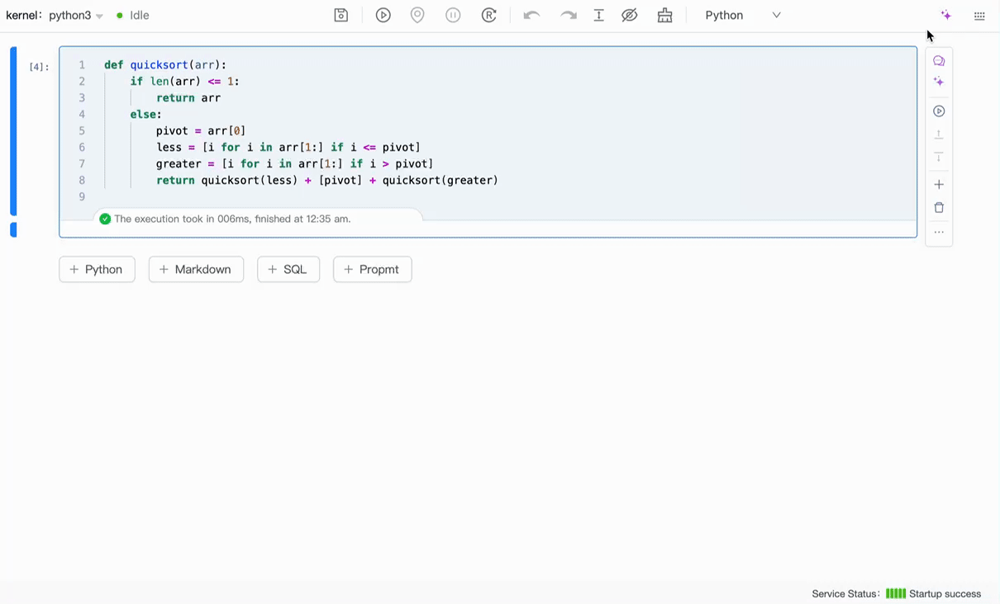
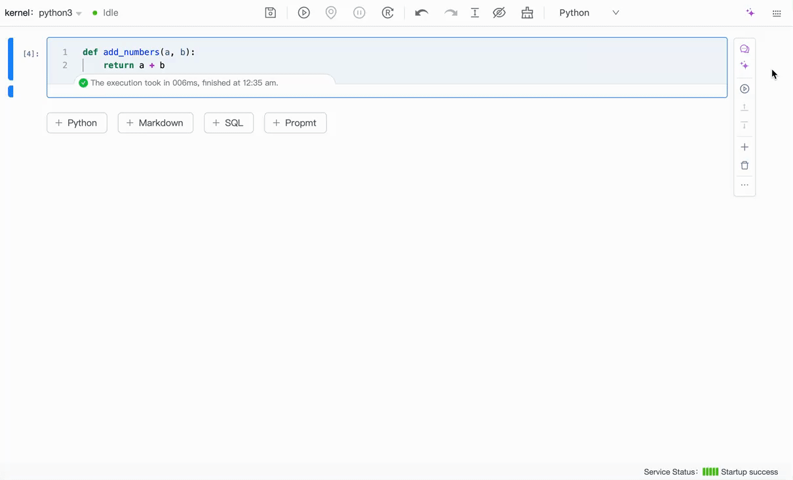

# overview

Experience libro's AI capabilities firsthand. Libro AI Programming Assistant is online! A variety of intelligent features are integrated to improve your programming efficiency and learning experience.

## Error repair

### error repair

When an error occurs in Cell execution, just click the "AI Repair" button, and the assistant will automatically analyze the error and give repair suggestions to help you quickly solve the problem and restore a smooth programming experience.

## AI dialogue

### Cell context session

You can interact directly with the AI to get in-depth answers and optimization suggestions related to your current code, improving your programming efficiency.

### General AI dialogue

You can have open conversations with the AI, ask questions about programming, get advice and information, and have fun interacting intelligently.

## Code interpretation

### Code interpretation

The AI Programming Assistant helps you understand the function and logic of the code in the Cell, making programming learning easier.

## code optimization

### code optimization

The AI programming assistant is able to analyze the code in the cell and provide suggestions for optimization. It will help you identify potential performance bottlenecks and improvement points, make your code more efficient and readable, and improve the overall programming experience.

