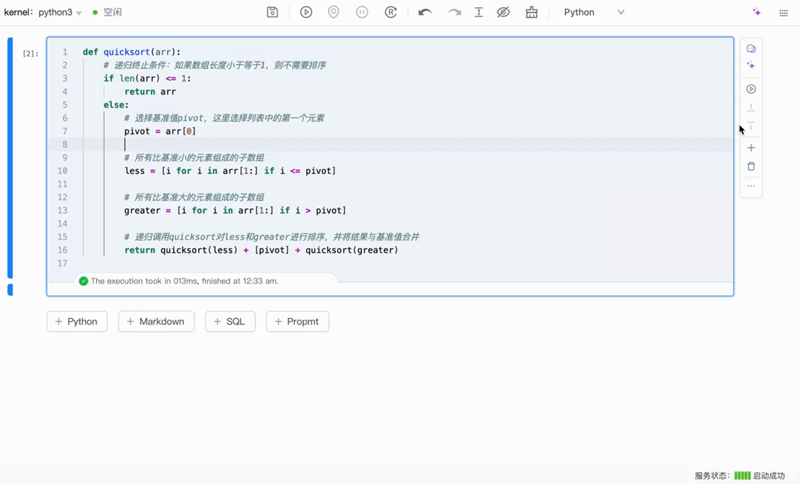
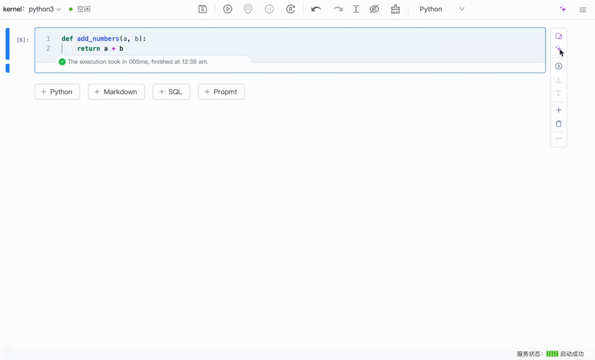

# 概述

直接体验 libro 的 AI 能力。Libro AI 编程助手正式上线！集成了多种智能功能，旨在提升你的编程效率和学习体验。

## 报错修复

### 错误修复

当 Cell 执行出现报错时，只需一键点击 “AI 修复” 按钮，助手会自动分析错误并给出修复建议，帮助你快速解决问题，恢复顺利的编程体验。

## AI 对话

### Cell 上下文对话

你可以直接与 AI 进行互动，获得与当前代码相关的深入解答和优化建议，提升编程效率。

### 通用 AI 对话：

你可以与 AI 进行开放式对话，询问编程相关问题，获取建议和信息，享受智能互动的乐趣。

## 代码解释

### 代码解释

AI 编程助手帮助你理解 Cell 中代码的功能和逻辑，让编程学习变得更加轻松。

## 代码优化

### 代码优化

AI 编程助手能够分析单元格（cell）中的代码，并提供优化建议。它将帮助你识别潜在的性能瓶颈和改进点，让你的代码更加高效、可读，提升整体编程体验。

