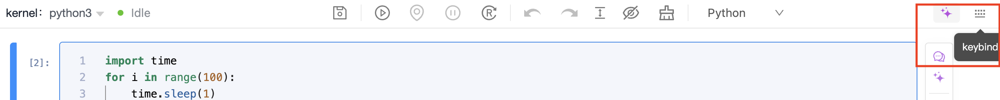
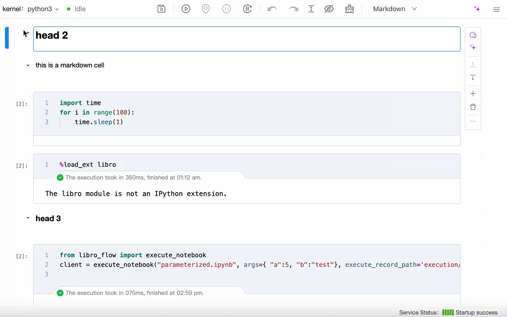

# Overview

The Libro Editor enhances the state monitoring of traditional Notebook operations and various interactive features. This article introduces the basic interface features of the Libro Editor, helping you understand its basic usage.

## Product Interface Introduction

| Interface Module          | Description                                                                                               |
| ------------------------- | --------------------------------------------------------------------------------------------------------- |
| Top Toolbar               | Contains kernel status area, operation control area, keybinds, etc.                                       |
| Cell Operation Area       | Lists executable operations for each individual Cell.                                                     |
| Cell Editing Area         | Functional areas within the code editing window, such as Cell linking area, output area, and bottom Cell. |
| Cell Feature Introduction | Introduces the functions and keybind operations of command mode and edit mode Cells.                      |

### Top Toolbar

| No. | Name                   | Description                                                                                                |
| --- | ---------------------- | ---------------------------------------------------------------------------------------------------------- |
| ①   | Kernel Status Area     | Displays the current status of the service kernel, including four states: connecting, unknown, busy, idle. |
| ②   | Operation Control Area | Provides various control operations, such as executing code, converting Cells, etc.                        |
| ③   | Keybind Panel          | View the directory of Libro keybinds.                                                                      |

#### Kernel Status Area

The Libro Notebook uses Python 3 as the base kernel, responsible for executing the user-input code Cells and managing the code execution status. In the Libro kernel status area, you can modify the kernel and view its status.

- Kernel Edit Menu

| Menu Option                       | Description                                                                                             |
| --------------------------------- | ------------------------------------------------------------------------------------------------------- |
| Start Preferred Kernel            | Start the preferred kernel set or previously used.                                                      |
| Use No Kernel                     | Selecting this option will not start any kernel, used for scenarios where code execution is not needed. |
| Use Kernel from Preferred Session | Use kernel configuration from an active session to maintain environmental consistency.                  |

Note: The kernel is an engine that executes computations, capable of running programming code and returning results.

- Kernel Status  
  The kernel status in Libro can be connecting, unknown, busy, or idle.

 The Libro Notebook is connecting to the kernel, which occurs when starting the kernel or attempting to connect after the kernel becomes unresponsive.

 The current status of the kernel is uncertain, possibly due to communication issues or internal errors preventing status information retrieval.

 The current kernel is processing code execution tasks, and your newly submitted code or commands will wait until the current task is complete before execution.

 Indicates that the kernel is currently not executing any tasks and is ready to accept new commands and code execution.

#### Operation Control Area

| Icon                                                                 | Description                                                                                                                     |
| -------------------------------------------------------------------- | ------------------------------------------------------------------------------------------------------------------------------- |
|           | Save changes made to the Cell contents in the current Notebook.                                                                 |
|            | Execute the selected range of Cells according to submenu options, such as executing all Cells, executing the current Cell, etc. |
|            | Locate the currently executing Cell.                                                                                            |
|      | Interrupt the code of the currently executing Cell.                                                                             |
|        | Restart and clear all Cell outputs.                                                                                             |
|           | Undo the last action.                                                                                                           |
|           | Redo the last undone action.                                                                                                    |
|  | Fix the height of the Output display.                                                                                           |
|           | Hide or show code and Output based on submenu options.                                                                          |
|          | Clear the output of the selected Cell.                                                                                          |
|   | Change Cell types, such as Python, Markdown, etc.                                                                               |

#### Sharing and Keybind

| Icon                                                           | Area Diagram                                                          | Description                                                                                   |
| -------------------------------------------------------------- | --------------------------------------------------------------------- | --------------------------------------------------------------------------------------------- |
|  |  | Display keybind operations for command mode and edit mode in Libro, providing Magic commands. |

### Cell Operation Bar

The Notebook supports convenient execution of Cell operations. In the operation bar to the right of each Cell, from top to bottom, there are options to run, move up, move down, add, delete, and access more menus.

| Icon/Button                                                   | Description                                                      |
| ------------------------------------------------------------- | ---------------------------------------------------------------- |
|     | Run the currently selected code Cell or re-run the code Cell.    |
|      | Move the currently selected code Cell up one position.           |
|    | Move the currently selected code Cell down one position.         |
|     | Add a Cell of the selected type below.                           |
|  | Delete the currently selected code Cell.                         |
|    | Provide functions to hide code and output, copy, cut, and paste. |

### Cell Editing Area

In the Notebook's code editing window, you can add multiple Cells to organize your project. The area between Cells is called the linking area, and the output pane generated after executing a Cell is referred to as the output area. The bottom of the last Cell is called the bottom Cell area.

#### Cell Linking Area

You can freely add specified types of Cells in this area.

Note: If you select a Cell without other Cells below it, you can directly add the corresponding type of Cell through the specified button at the bottom. For more details, refer to the bottom Cell section.

#### Cell Output Area

You can view the execution time and results after executing this Cell below it.

Note: Currently, only Python Cells and Prompt Cells support output content, while others are for illustrative and display purposes.

#### Fixed Output Height for Cells

If the output content is lengthy, you can choose to fix or unfix the height of the output window for an optimal viewing experience.

#### Bottom Cell

The bottom of the last Cell in the experiment file provides an explicit button to add a Cell of the specified type.

Note: Additionally, you can add Cells in the Cell linking area or the Cell operation bar, and switch Cell types through the Cell control area.

## Introduction to Interactive Operations

On the right side of the top toolbar, you can view keybinds to see or search for all keybind functions and Notebook Magic commands within the product. Here are a few common operations:

 

### Command Mode | Edit Mode

The Notebook distinguishes between command mode and edit mode based on operation functions.

- In edit mode, clicking in a blank area of the code editing page or using the Esc key enters command mode, where the border of the currently selected Cell is blue.

- In command mode, you can enter edit mode by using the Enter key or directly clicking the Cell editing box. The border of the currently selected Cell is highlighted in blue.

Note: For Markdown type Cells, double-clicking with the left mouse button is required to enter edit mode from command mode.

### Command Mode

In command mode, the following common functionalities are supported.

#### Multi-select Cells

Selected Cells are highlighted in blue. You can select multiple Cells for batch operations, such as batch execution (Ctrl/Command+Enter) and batch copying (C), pasting (V), etc., allowing for flexible combinations.

| Keybind            | Description                                                                        |
| ------------------ | ---------------------------------------------------------------------------------- |
| Shift+Up/Shift+K   | Select multiple Cells upwards; click Up/K N times to select N Cells upwards.       |
| Shift+Down/Shift+J | Select multiple Cells downwards; click Down/J N times to select N Cells downwards. |

Here’s the translation of your text:

---

#### Converting Cells

In command mode, you can use keyboard keybinds to convert cells between Markdown and Python types.

| Keybind | Description                                                                                 |
| ------- | ------------------------------------------------------------------------------------------- |
| M       | Convert the cell to Markdown type; keybinds 1/2/3/4/5/6 correspond to headings 1/2/3/4/5/6. |
| Y       | Convert the cell to Python type.                                                            |

#### Merging Cells

In command mode, you can merge the contents of the currently selected cell with the adjacent previous or next cell using keyboard keybinds.

| Keybind              | Description                        |
| -------------------- | ---------------------------------- |
| Ctrl/Command+Shift+M | Merge with the next adjacent cell. |

Note: Multiple cells can be selected, and you can perform bulk merges using Shift + M.

#### Executing Cells

In command mode, you can execute cells using the following keybinds:

| Keybind            | Description                                                                       |
| ------------------ | --------------------------------------------------------------------------------- |
| Ctrl/Command+Enter | Execute the currently selected cell.                                              |
| Shift+Enter        | Execute the currently selected cell and select the next cell.                     |
| Alt/Opt+Enter      | Execute the currently selected cell and insert a new cell of the same type below. |

#### Dragging Cells

  When you move your mouse to the left side of the cell box, the following style appears:
  
  You can then drag the current cell.

- **Dragging a Single Cell** (regardless of command or edit mode)  
  When you move your mouse to the left side of the target cell and the style appears, you can drag it.

 

Note: During dragging, the blue horizontal bar serves as a positioning marker, indicating where you are dragging to, below the blue bar.

- **Dragging Multiple Cells**  
  In command mode, after selecting multiple cells, when you move your mouse to the left side of the cell box and the style appears, you can drag multiple cells simultaneously.

### Edit Mode

In edit mode, the following common functionalities are supported.

#### Splitting Cells

You can split the contents of a cell into different sections, placing them into separate cells.

<table>
<thead>
<tr>
<th>Keybind</th>
<th>Support Method</th>
<th>Description</th>
</tr>
</thead>
<tbody>
<tr>
<td rowspan="2">Ctrl/Command+Shift+-</td>
<td>Split at the cursor's position</td>
<td>The contents before and after the cursor are split into two separate cells.</td>
</tr>
<tr>
<td>Use the selected content's boundaries as split points</td>
<td>The boundaries around the selected content are used as split points, splitting the original cell's content into three segments, which are placed into three separate cells.</td>
</tr>
</tbody>
</table>

#### Cursor Movement

| Keybind              | Description                                       |
| -------------------- | ------------------------------------------------- |
| Ctrl/Command + Left  | Move the cursor to the start of the current line. |
| Ctrl/Command + Right | Move the cursor to the end of the current line.   |
| Ctrl/Command + Up    | Move the cursor to the start of the file.         |
| Ctrl/Command + Down  | Move the cursor to the end of the file.           |

### Left Sidebar

Clicking on the long bar to the left of the cell allows you to hide or show the corresponding cell area.

#### Hiding and Showing Cell Input Sections

#### Hiding and Showing Cell Output Sections

## Introduction to Cells

### Python Cell

A Python cell is the smallest unit for editing and debugging Python code in the notebook, primarily featuring the following functionalities:

| Function                       | Description                                                                                                                  |
| ------------------------------ | ---------------------------------------------------------------------------------------------------------------------------- |
| Code Writing                   | Provides an area for writing source code, supporting syntax highlighting and auto-completion.                                |
| Cell Debugging                 | Allows line-by-line debugging of code within a cell, helping to identify logical errors and exceptions.                      |
| Output Debugging Window        | Displays the output results of code execution, including printed text, graphics, error messages, etc.                        |
| Code Generation                | Automatically generates code snippets based on user input to enhance development efficiency.                                 |
| Using Frameworks and Libraries | Built-in rich libraries support the import and use of various Python frameworks and libraries, expanding code functionality. |

### Markdown Cell

| Function             | Description                                                                                         |
| -------------------- | --------------------------------------------------------------------------------------------------- |
| Text Editing         | Provides an input area for writing Markdown-formatted text.                                         |
| Formatted Display    | Supports rendering Markdown into formatted HTML after editing.                                      |
| Element Insertion    | Supports inserting links, images, tables, lists, and other Markdown elements.                       |
| Document Structuring | Uses Markdown syntax to create structured documents, such as headings, subheadings, and paragraphs. |
| Code Block Support   | Supports inserting code blocks with syntax highlighting for different programming languages.        |

Note: Additionally, support for hiding and revealing Markdown cells based on headings helps you better organize and view the notebook.

