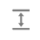
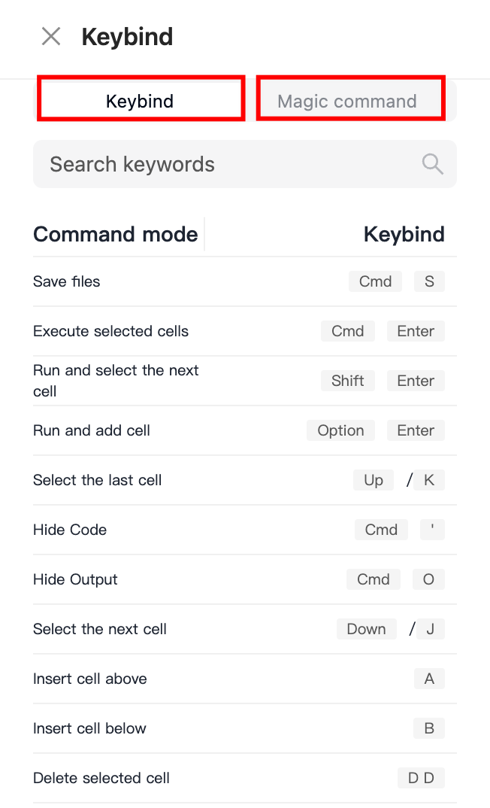
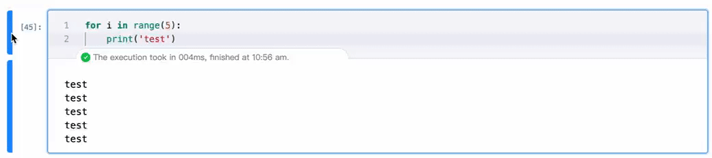

# 概述

Libro 编辑器增强了传统 Notebook 运行的状态监控以及各种交互操作，本文为您介绍 Libro 编辑器的基础界面功能，帮助您了解 Libro 编辑器的基本使用方法。

## 产品界面介绍

| 界面模块      | 说明                                                            |
| ------------- | --------------------------------------------------------------- |
| 上方工具栏    | 包含内核状态区、操作控制区、快捷键等。                          |
| Cell 操作区   | 罗列针对每一个独立的 Cell 可执行的操作。                        |
| Cell 编辑区   | 代码编辑窗口中的功能区域，如 Cell 衔接区、输出区、底部 Cell等。 |
| Cell 功能介绍 | 介绍命令态和编辑态 Cell 的功能和快捷键操作。                    |

### 上方工具栏

| 序号 | 名称       | 描述                                                                 |
| ---- | ---------- | -------------------------------------------------------------------- |
| ①    | 内核状态区 | 展示当前服务的内核运行状态，包括正在连接、未知、忙碌、空闲四种状态。 |
| ②    | 操作控制区 | 提供各种控制操作，如对代码执行、Cell 转换的操作等。                  |
| ③    | 快捷键面板 | 查看 Libro 快捷键目录。                                              |

#### 内核状态区

Libro Notebook 采用 Python3 作为基础内核，负责运行用户输入的代码单元（Cell），管理代码执行的状态。在 Libro 的内核状态区，您可以修改内核和查看内核状态。

- 内核编辑菜单

| 菜单选项                          | 描述                                               |
| --------------------------------- | -------------------------------------------------- |
| Start Preferred Kernel            | 启动设定或之前使用的首选内核。                     |
| Use No Kernel                     | 选择此选项不会启动任何内核，用于不执行代码的场景。 |
| Use Kernel from Preferred Session | 使用已开启会话中的内核配置，保持环境一致性。       |

说明：内核（Kernel）是一个执行计算的引擎，它能够运行编程代码并返回结果。

- 内核状态
  Libro 的内核状态分为正在连接、未知、忙碌、空闲。

 Libro Notebook 正在与内核建立连接，发生在启动内核或者内核失去响应后尝试连接的情况。

 当前内核的状态不能确定，可能是由于通信问题或内部错误导致状态信息无法获取。

 当前内核正在执行代码处理任务，您提交的新代码或指令将等待当前任务完成后才会被执行。

 表示内核当前没有执行任何任务，已经准备好接受新的命令和代码执行。

#### 操作控制区

| 图标                                                                 | 描述                                                                     |
| -------------------------------------------------------------------- | ------------------------------------------------------------------------ |
|           | 保存当前 Notebook 中 Cell 内容的改动。                                   |
|            | 按照子菜单选项，执行选中范围的 Cell，如执行全部 Cell、执行当前 Cell 等。 |
|            | 定位正在执行的 Cell。                                                    |
|      | 中断正在执行的 Cell 代码。                                               |
|        | 重启并清空所有 Cell 的输出。                                             |
|           | 撤销上一步操作。                                                         |
|           | 重做上一步被撤销的操作。                                                 |
|  | 固定 Output 展示高度。                                                   |
|           | 根据子菜单选项，隐藏或显示代码和 Output。                                |
|          | 清空选中 Cell 的输出。                                                   |
|   | 更改 Cell 类型，如 Python、Markdown 等                                   |

#### 分享和快捷键

| 图标                                                           | 区域图                                                                | 说明                                                   |
| -------------------------------------------------------------- | --------------------------------------------------------------------- | ------------------------------------------------------ |
|  |  | 展示命令态和编辑态 Libro 的快捷键操作，提供 Magic 命令 |

### Cell 操作栏

Notebook 支持针对单元格便捷执行 Cell 操作。在 Cell 右侧的操作栏中，从上至下分别是运行、上移、下移、增加、删除、更多菜单。

| 图标/按钮                                                     | 描述                                         |
| ------------------------------------------------------------- | -------------------------------------------- |
|     | 运行当前选中的代码单元或重新运行代码单元。   |
|      | 将当前选中的代码单元上移一个位置。           |
|    | 将当前选中的代码单元下移一个位置。           |
|     | 在下方增加选中类型的单元格。                 |
|  | 删除当前选中的代码单元。                     |
|    | 提供隐藏代码和输出、复制、剪切、粘贴的功能。 |

### Cell 编辑区

在 Notebook 代码编辑窗口中，您可以添加多个 Cell 来组织您的项目。Cell 之间的区域为衔接区，Cell 执行完毕产生的输出窗格为输出区，最后一个 Cell 底部称为 Cell 底部区。

#### Cell 衔接区

您可以在该区域自由添加指定类型的单元格。

说明：如果您选中的 Cell 后无其他单元格，可以直接在底部通过指定按钮添加对应类型的单元格。详情请参见底部 Cell。

#### Cell 输出区

支持在单元格下方查看执行此 Cell 后的运行时间和运行结果。

注意：目前仅支持执行 Python Cell 和 Prompt Cell 并产生输出内容，其余均为说明性、展示性 Cell。

#### Cell 固定 Output 高度

如果输出内容较长，您可以选择固定或取消输出窗口的高度，以获取最佳视图体验。

#### 底部 Cell

实验文件中最后一个 Cell 的底部提供显式添加指定类型单元格的按钮。

说明：同时，支持在 Cell 衔接区或 Cell 操作栏添加单元格，通过 Cell 控制区的类型转换来切换单元格类型。

## 交互操作介绍

支持在上方工具栏右侧，通过查看快捷键，查看或搜索产品内所有快捷键功能和 Notebook Magic 命令，以下为您介绍几种常用的操作：

 

### 命令态 | 编辑态

Notebook 将针对操作功能分为命令态和编辑态。

● 在编辑态下单击代码编辑页面空白处或快捷键 Esc 进入命令态，当前选中的 Cell 边框为蓝色。

● 在命令态时通过快捷键 Enter 进入编辑态或直接单击 Cell 编辑框。当前选中的 Cell 边框为蓝色高亮显示。

注意：Markdown 类型的 Cell 由命令态进入编辑态需要双击鼠标左键。

### 命令态

在命令态下，支持以下常见功能。

#### 多选 Cell

被选中的 Cell 背景为蓝色阴影，支持选中多个单元格以进行批量操作，如批量执行（Ctrl/Command+Enter）和批量复制(C)、粘贴(V)等，您可以自由搭配使用。

| 快捷键             | 效果                                                       |
| ------------------ | ---------------------------------------------------------- |
| Shift+Up/Shift+K   | 向上选中多个 Cell，单击 Up/K N 次，则向上选中 N 个 Cell。  |
| Shift+Down/Shift+J | 向下选中多个 Cell，单击 Down/J N次，则向下选中 N 个 Cell。 |

说明：另外，您可以按住 shift，选中一个 Cell 并以此为基准，单击另一个目标 Cell 的左侧区域，即可向上或向下选中该范围内的所有 Cell。

#### 转换 Cell

在命令态下，选中单元格，通过快捷键可以实现 Markdown 到 Python 类型的互相转换。

| 快捷键 | 效果                                                                     |
| ------ | ------------------------------------------------------------------------ |
| M      | 将 Cell 转换为 Markdown 类型，快捷键1/2/3/4/5/6分别支持标题1/2/3/4/5/6。 |
| Y      | 将 Cell 转换为 Python 类型。                                             |

#### 合并 Cell

在命令态下，支持通过快捷键合并当前选中 Cell 和相邻上一个或下一个 Cell 的内容。

| 快捷键               | 效果                    |
| -------------------- | ----------------------- |
| Ctrl/Command+Shift+M | 合并相邻的下一个 Cell。 |

说明：支持多选 Cell，并通过shift + m 进行批量合并。

#### 执行 Cell

在命令态下，您可以通过快捷键启动 Cell 执行，支持以下执行方式：

| 快捷键             | 效果                                   |
| ------------------ | -------------------------------------- |
| Ctrl/Command+Enter | 执行当前 Cell。                        |
| Shift+Enter        | 执行当前 Cell 并选中下一个单元格。     |
| Alt/Opt+Enter      | 执行当前 Cell 并向下插入同类型单元格。 |

#### 拖拽 Cell

  当您将鼠标移至 Cell 框左侧，出现样式
  
    时，可以对当前 Cell 进行拖拽。

- 拖拽单个 Cell（不区分命令态和编辑态）
  当您将鼠标移至目标 Cell 框左侧，出现样式时，即可进行拖拽。

 

说明：拖拽时，蓝色横条作为定位标记，表示拖拽至蓝色横条下方。

- 拖拽多个 Cell
  在命令态下，多选 Cell 后，当您将鼠标移至 Cell 框左侧，出现样式时，可以同时拖拽多个 Cell。

### 编辑态

在编辑态下，支持以下常见功能。

#### 切分 Cell

支持将一个单元格中的内容切分为不同的段，分别放入不同的单元格中。

<table>
<thead>
<tr>
<th>快捷键</th>
<th>支持方式</th>
<th >效果</th>
</tr>
</thead>
<tbody>
<tr>
<td rowspan="2">Ctrl/Command+Shift+-</td>
<td>通过光标定位分割点</td>
<td >光标前后的内容被分割开来，分别放入两个单元格中。</td>
</tr>
<tr>
<td>选中内容的前后作为分割点</td>
<td>选中内容的前后都作为分割点，原单元格内容被切分为三段，分别放入三个单元格。</td>
</tr>
</tbody>
</table>

#### 光标移动

| 快捷键               | 功能                            |
| -------------------- | ------------------------------- |
| Ctrl/Command + Left  | 光标移至当前行的行首            |
| Ctrl/Command + Right | 光标移至当前行的行尾            |
| Ctrl/Command + Up    | 光标移至文件的开始处（文件首）  |
| Ctrl/Command + Down  | 光标移至文件的结束处（文件尾）} |

### 左侧长条

单击 Cell 左侧的长条支持隐藏与显示长条所对应的 Cell 区域部分。

#### 隐藏与显示 Cell 输入部分

#### 隐藏与显示 Cell 输出部分

## Cell 介绍

### Python Cell

Python Cell 是 Notebook 中编辑和调试 Python 代码的最小单元，主要包含以下使用功能：

| 功能         | 说明                                                             |
| ------------ | ---------------------------------------------------------------- |
| 代码编写     | 提供用于编写源代码的编辑区域，支持语法高亮和自动代码补全等。     |
| 单元调试     | 允许逐单元(cell)逐行调试代码，帮助识别代码中的逻辑错误和异常。   |
| 输出调试窗格 | 显示代码执行的输出结果，包括打印的文本、图形、错误信息等。       |
| 代码生成     | 根据用户输入自动生成代码片段，提高开发效率。                     |
| 使用框架和库 | 内置丰富类库，支持导入和使用多种 Python 框架和库，扩展代码功能。 |

### Markdown Cell

| 功能       | 说明                                                       |
| ---------- | ---------------------------------------------------------- |
| 文本编辑   | 提供文本输入区域，用于编写 Markdown 格式的文本内容。       |
| 格式化展示 | 在编辑完成后，支持渲染 Markdown 为格式化的 HTML 展示。     |
| 插入元素   | 支持插入链接、图片、表格、列表等 Markdown 元素。           |
| 文档结构化 | 使用 Markdown 语法创建有结构的文档，如标题、子标题、段落。 |
| 代码块支持 | 支持插入代码块，并对不同编程语言进行语法高亮。             |

说明：此外，支持基于标题的 Markdown Cell 进行隐藏与现实，帮助您更好的组织与查看 Notebook

