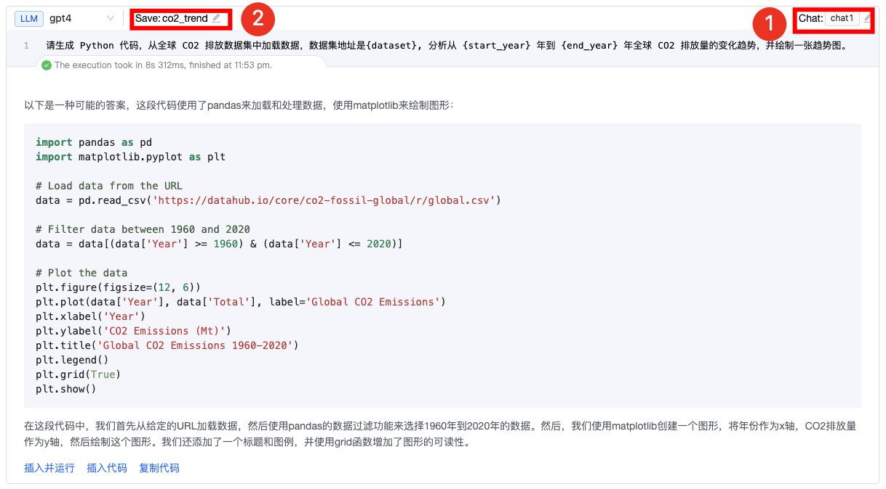
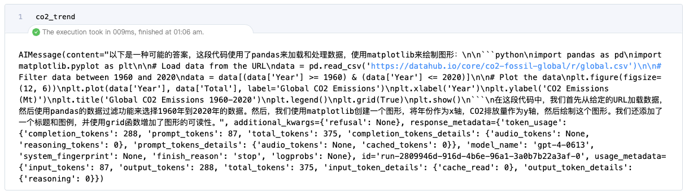

## 什么是 Prompt Cell？

Prompt Cell 是一种特殊的 notebook cell，通过这个 cell，用户只需要输入自然语言指令，就可以调用大模型进行推理，得到所需的输出结果。它的出现减少了编写复杂代码的需求，并且可以灵活地融入现有的工作流中，尤其是在需要频繁与 AI 进行交互的场景中。
目前 libro 的 Prompt Cell：

- 内置了 chatgpt、gpt4、dalle-3 模型，您可以基于 libro-ai 扩展自己的模型～
- 支持选择聊天标识，使得选择该聊天标识的 Prompt Cell 都在一个聊天上下文中.
- 支持 Prompt Cell 保存为一个变量，该变量即为 langchain 的 AIMessage.

接下来我们将展示一个实际案例，如何通过 Prompt Cell 和 Python 变量的结合连接模型、生成代码、保存分析结果，并将这些分析结果通过对话历史进行传递。

## 场景：全球 CO2 排放数据分析与未来预测

这个案例中，我们将通过 Prompt Cell，连接大模型执行对未来 20 年全球 CO2 排放的预测，同时生成相应的 Python 代码进行可视化分析。

### 准备工作

1. 在 `~/.libro/libro_config.yaml` 配置大模型 key，并且启用 libro-ai 扩展。

```yaml
llm:
  OPENAI_API_KEY: sk-xxx
jpserver_extensions:
  libro_ai: True
```

2. 在终端中运行命令 `libro` 启动 libro

### 步骤 1: 分析 CO2 排放趋势

1. 定义时间范围以及数据集地址变量的 Python 变量，注意这些变量必须是字符串类型：


2. 在 Prompt Cell 中通过自然语言输入连接模型进行加载数据集，可视化排放趋势的代码生成操作
① 增加新的聊天标识，使得后续选择该聊天标识的 Prompt Cell 都在一个聊天上下文中.
② 整个 Prompt Cell 消息保存为一个变量，该变量即为 langchain 的 AIMessage.




3. 点击 “插入并运行选项” 会自动新增一个内容对应为模型生成代码的 Python Cell，并且运行。


### 步骤 2: 预测未来 CO2 排放量

1. 使用 Prompt Cell 生成预测未来 CO2 排放量的代码，并选择与前一个 Prompt Cell 同一个聊天标识，同时保存变量。


2. 点击 “插入并运行选项” 会自动新增一个内容对应为模型生成代码的 Python Cell，并且运行。


### 步骤 3: 基于 Langchain 消息提出应对 CO2 排放的建议

此外，我们也可以配合着 langchain 一起使用，例如，基于前面保存的 co2_predict变量，生成应对气候变化的行动建议


