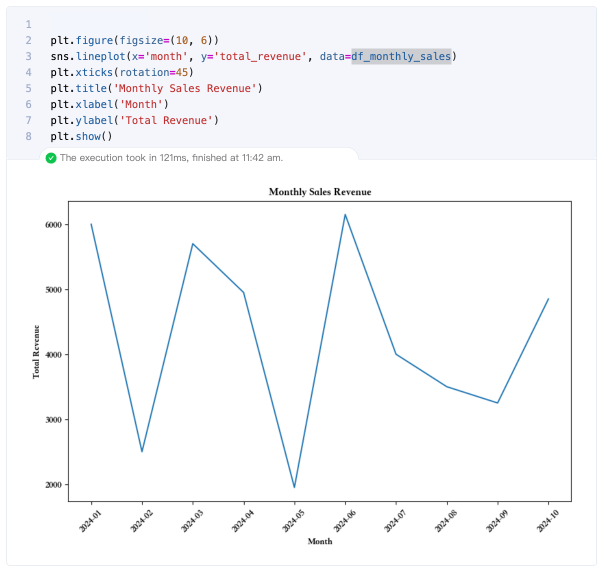

# 概述

libro 支持使用 SQL Cell 来简化数据库交互，通过在 libro 中结合 SQL 和 Python，你可以：

- 直接查询数据库，快速获取数据，支持把结果保存为 dataframe。
- 使用 Python 对查询结果进行进一步的处理和可视化。
- 将 SQL 的强大查询能力与 Notebook 的动态性结合，提升开发效率。

下面我们通过一个完整的例子展示如何在 libro 中使用 SQL Cell 来操作数据库，并结合 Python 进行数据分析。

## 📍场景：电子商务平台的销售数据分析

假设我们管理一个电子商务平台，并且希望通过分析销售数据来优化业务策略。数据库中包含多个表，比如 orders（订单表）、customers（客户表）、products（产品表）和 order_items（订单项表），记录了客户的订单和购买情况。我们将通过在 libro 中使用 SQL Cell 来解决以下几个常见问题：

1. 分析不同产品的销量：统计每个产品的销售数量和收入。
2. 分析客户购买行为：找出每个客户的购买总额和平均订单金额。
3. 找出平台的最佳销售月份：通过时间维度分析平台的销售表现。

### 准备工作

1. 配置数据库的连接信息，在 `~/.libro/libro_config.yaml` 中添加数据库的连接配置。

```yaml
db:
  - db_type: postgresql
    username: 'libro'
    password: '12345678'
    host: '127.0.0.1'
    port: 5432
    database: libro
```

> <span style="font-style: normal;">💡 **Tip**: 如果没有上述 libro 的配置文件可通过在终端中运行命令 `libro config generate` 生成.</span>

2. 在终端中运行命令libro启动 libro

### 案例 1：分析不同产品的销量

1. 查询不同产品的销量
   我们首先通过 SQL 查询来统计每个产品的销量和总收入。这个查询将返回每个产品的销售数量以及它所产生的总收入，同时把查询结果保存到 Pandas DataFrame 中。


2. 可视化产品销售表现
   我们可以使用 Python 的可视化工具（如 Matplotlib 或 Seaborn）对产品销量进行直观展示，通过这个直方图，我们可以快速了解哪些产品是平台上最畅销的。


### 案例 2：分析客户的购买行为

1. 统计每个客户的订单数量、总消费金额和平均订单金额
   我们首先通过 SQL 查询来统计他们的总购买金额和平均订单金额。这个查询将返回每个客户的订单数量、总消费金额和平均订单金额。通过这些数据，我们可以了解哪些客户是平台的忠实用户，以及他们的消费习惯。


2. 数据分析
   通过 Python，可以进一步处理这些数据，找出不同客户的消费模式，例如哪些客户属于高价值客户。


案例 3：找出最佳销售月份

1. 查询每个月的总销售额
   我们通过时间维度分析平台的最佳销售月份，这个查询会返回每个月的总销售额，并按降序排列，以便你了解哪几个月份的销售额最高。


2. 可视化每月销售额趋势
   我们可以将每个月的销售数据可视化为折线图，通过这个折线图，可以轻松地看到不同月份的销售趋势，帮助调整库存和营销策略。



# 最后

通过这个电子商务平台的销售数据分析案例，我们展示了如何在 libro 中使用 SQL Cell 来解决实际问题，包括产品销量分析、客户行为分析以及销售趋势分析。你可以根据自己的需求扩展这些分析方法，在 libro 中结合 SQL 和 Python 的强大能力，进行个性化的数据分析。
