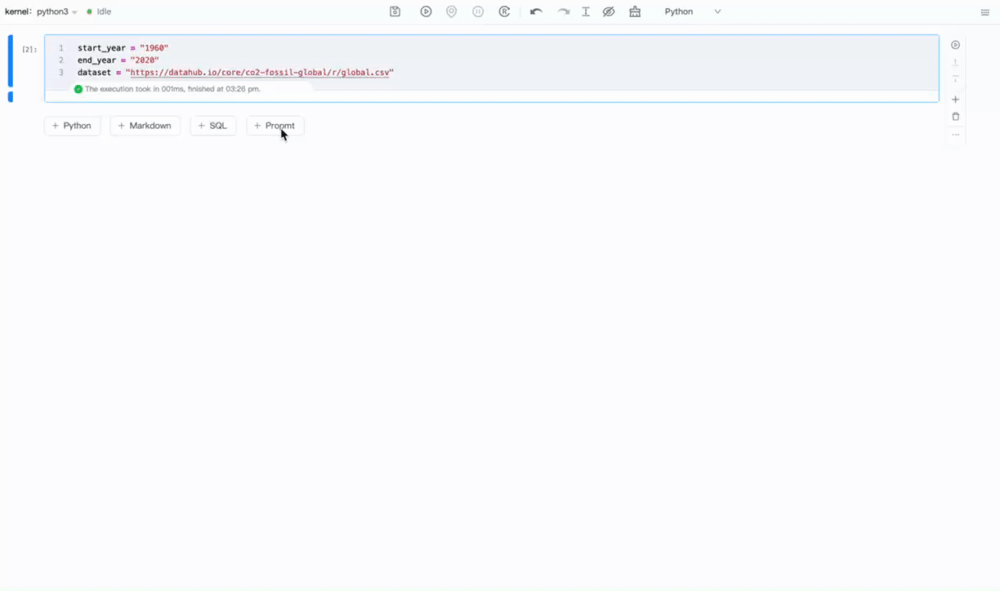

# 2024-10-14

🎉🎉🎉 Recently, we have focused on enhancing the flexibility and intelligent experience of our product, launching several practical new features. These features not only make configuration management more convenient but also significantly optimize interactions with AI and databases. Below are the key highlights of this update, and we welcome your feedback!

🌟 GitHub: [https://github.com/difizen/libro](https://github.com/difizen/libro)

🌟 Official Website: [https://libro.difizen.net/](https://libro.difizen.net/)

## 1. Support for Prompt Cell

The Prompt Cell is a special type of notebook cell that allows users to input natural language commands to invoke large models for inference and obtain the desired output. Its introduction reduces the need to write complex code and can be flexibly integrated into existing workflows.

Currently, the Prompt Cell in Libro:

- Includes built-in models such as ChatGPT, GPT-4, and DALL-E 3, and you can extend models in the following ways:
  - Define variables for conversational objects like LLMs and agents based on Langchain, which can be used directly in the Prompt Cell.
  - Expand your own models based on Libro-AI.
- Supports the selection of chat identifiers, so that all Prompt Cells with the selected identifier are within the same chat context.
- Allows saving the Prompt Cell as a variable, which is an AIMessage from Langchain.

For more details, please see the [Prompt Cell User Guide](../manual/prompt-cell.md).

## 2. Support for SQL Cell

We have introduced SQL Cell support, enabling users to write and execute SQL queries directly in the notebook environment, accessing and manipulating databases. This feature provides a seamless integration experience for data analysis, visualization, and database-driven application development.

By combining SQL and Python in Libro, you can:

- Configure built-in support for connections to MySQL, SQLite, and PostgreSQL databases.
- Query databases to quickly retrieve data, supporting the saving of results as dataframes.
- Use Python for further processing and visualization of query results.
- Combine SQL’s powerful querying capabilities with the dynamism of notebooks, enhancing development efficiency.

For more details, please see the [SQL Cell User Guide](../manual/sql-cell.md).

## 3. File-Level Configuration Capabilities

Configuration management is no longer cumbersome! We have introduced file-level configuration features, allowing users to automatically generate configuration file templates in their user directory by running the simple command `libro config generate`. Currently, it supports database connection configuration and large model key configuration.

## 4. Support for Language Switching Between Chinese and English

We have also launched a language switching feature between Chinese and English. Users can easily switch to their preferred language interface, achieving localization of the development environment.

# Summary

This version update brings comprehensive enhancements to several features. The file-level configuration capability greatly improves flexibility, while the Prompt Cell and SQL Cell enhance the usability of AI and database operations, respectively. The language switching feature provides users with a better localization experience. We will continue to iterate and introduce more features to enhance development efficiency, so stay tuned!

If you have any questions or suggestions about these new features, feel free to contact us or discuss them in the community.

💬 [Chat with us on Discord](https://discord.gg/RbZ9aEKK)

🤗 [Join our DingTalk Q&A group](https://qr.dingtalk.com/action/joingroup?code=v1,k1,52f1gKWwsZBMrWjXHcQFlOJEQIbbrMO86Iulu3T3ePY=&_dt_no_comment=1&origin=11)
