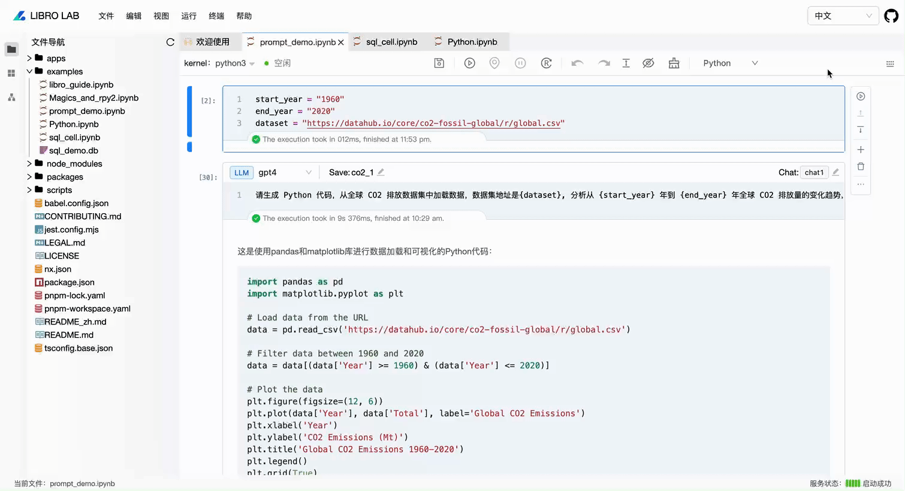

# 2024-10-14

🎉🎉🎉 近期，我们聚焦于提升产品的灵活性和智能化体验，推出了多个实用的新功能。这些功能不仅使配置管理更加便捷，还极大地优化了与 AI 和数据库的交互流程。以下是本次更新的核心亮点，欢迎大家使用反馈～

🌟 GitHub: [https://github.com/difizen/libro](https://github.com/difizen/libro)

🌟 官网：[https://libro.difizen.net/](https://libro.difizen.net/)

## 1. 支持 Prompt Cell

Prompt Cell 是一种特殊的 notebook cell，通过这个 Cell，用户只需要输入自然语言指令，就可以调用大模型进行推理，得到所需的输出结果。它的出现减少了编写复杂代码的需求，并且可以灵活地融入现有的工作流中。

目前 libro 的 Prompt Cell：

- 内置了 chatgpt、gpt4、dalle-3 模型，您还可以通过以下方式扩展模型～
  - 基于 langchain 定义 llm、agent 等可对话对象的变量，他们可以直接用在 Prompt cell 中。
  - 基于 libro-ai 扩展自己的模型。
- 支持选择聊天标识，使得选择该聊天标识的 Prompt Cell 都在一个聊天上下文中。
- 支持 Prompt Cell 保存为一个变量，该变量即为 langchain 的 AIMessage。

详情可看：[Prompt Cell 使用指南](../manual/prompt-cell.md)。

## 2. 支持 SQL Cell

我们引入了 SQL Cell 支持，用户可以直接在 notebook 环境中编写并执行 SQL 查询，访问和操作数据库。这一功能为数据分析、可视化、以及数据库驱动型应用开发带来了无缝的集成体验。

通过在 libro 中结合 SQL 和 Python，您可以：

- 直接配置内置支持 mysql、sqlite、postgresql 数据库连接。
- 查询数据库，快速获取数据，支持把结果保存为 dataframe。
- 使用 Python 对查询结果进行进一步的处理和可视化。
- 将 SQL 的强大查询能力与 Notebook 的动态性结合，提升开发效率。

详情可看：[SQL Cell 使用指南](../manual/sql-cell.md)。

## 3. 文件级别的配置能力

配置管理不再繁琐！我们引入了文件级别的配置功能，用户可以通过运行简单的一条命令 libro config generate，自动在用户目录下生成配置文件模板。目前支持数据库连接配置和大模型密钥配置。

## 4. 支持中英文语言切换

我们还推出了中英文语言切换功能。用户可以在切换选择所需的语言界面，轻松实现开发环境的本地化。

# 总结

这次版本更新带来了多项功能的全面提升，文件级别的配置能力大幅提高了灵活性，Prompt Cell 和 SQL Cell 分别加强了 AI 与数据库操作的易用性，语言切换功能则为用户提供了更好的本地化体验。未来我们将持续迭代，推出更多有助于提升开发效率的功能，敬请期待！

如果您对这些新功能有任何问题或建议，欢迎联系我们或在社区中讨论。

💬 [Chat with us on Discord](https://discord.gg/RbZ9aEKK)

🤗 [Join our DingTalk Q&A group](https://qr.dingtalk.com/action/joingroup?code=v1,k1,52f1gKWwsZBMrWjXHcQFlOJEQIbbrMO86Iulu3T3ePY=&_dt_no_comment=1&origin=11)
