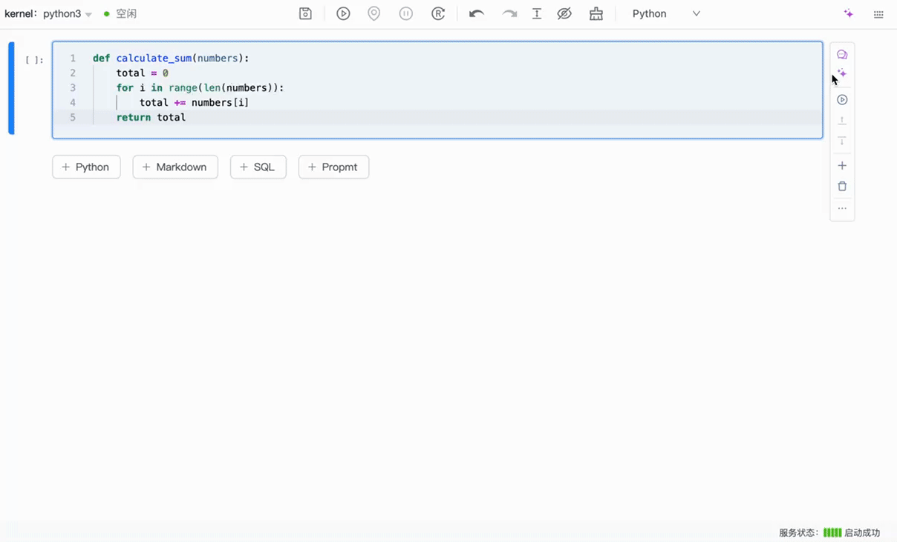

# 2024-11-01

# 🚀 全新上线！AI 编程助手助力你的 Notebook 体验！

Libro AI 编程助手正式上线！集成了多种智能功能，旨在提升你的编程效率和学习体验，以下是本次更新的核心内容，快来体验，让你的编程之旅更轻松、高效！

- 错误修复：修复代码中的错误，助你轻松解决编程难题。
- AI 对话：与 AI 进行智能对话，获取实时反馈和建议，让编程变得更加顺畅。
- 代码解释：对复杂代码提供详细解释，帮助你深入理解每一行代码的含义。
- 代码优化：根据最佳实践提供优化建议，提升代码的性能与可读性。

🌟 GitHub：https://github.com/difizen/libro

🌟 官网：https://libro.difizen.net/

## 新特性

### 错误修复

当 Cell 执行出现报错时，只需一键点击 “AI 修复” 按钮，助手会自动分析错误并给出修复建议，帮助你快速解决问题，恢复顺利的编程体验。

### AI 对话

**Cell 上下文对话**：你可以直接与 AI 进行互动，获得与当前代码相关的深入解答和优化建议，提升编程效率。

**通用 AI 对话**：你可以与 AI 进行开放式对话，询问编程相关问题，获取建议和信息，享受智能互动的乐趣。

### 代码解释

AI 编程助手帮助你理解 Cell 中代码的功能和逻辑，让编程学习变得更加轻松。

### 代码优化

AI 编程助手能够分析单元格（cell）中的代码，并提供优化建议。它将帮助你识别潜在的性能瓶颈和改进点，让你的代码更加高效、可读，提升整体编程体验。

## 历史修复

1. Sql Cell 高亮问题
2. 折叠 Markdown Cell 后新建单元格错位
3. tqdm 进度条完成后无法及时清除
4. `libro config generate` 生成配置文件失效
5. 浏览器旧版的缓存问题

## 总结

这次版本带来全新的编程助手，通过智能错误修复、AI 对话、代码解释和优化功能，为你的 Notebook 编程体验提供全方位支持，助力你高效、轻松地实现编程目标！未来我们将持续迭代，推出更多实用的功能，敬请期待！

如果您对这些新功能有任何问题或建议，欢迎联系我们或在社区中讨论。

💬 [Chat with us on Discord](https://discord.gg/B4V7AWy4)

🤗 [Join our DingTalk Q&A group](https://qr.dingtalk.com/action/joingroup?code=v1,k1,52f1gKWwsZBMrWjXHcQFlOJEQIbbrMO86Iulu3T3ePY=&_dt_no_comment=1&origin=11)
