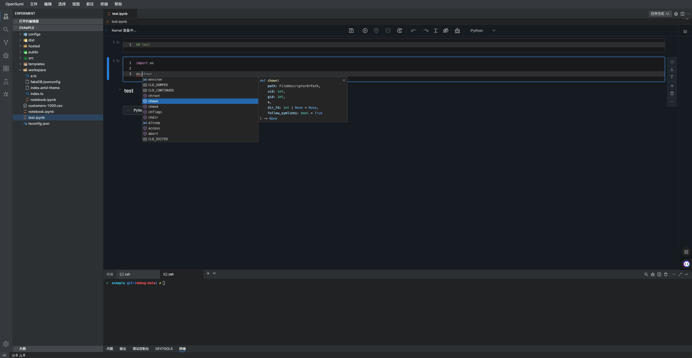
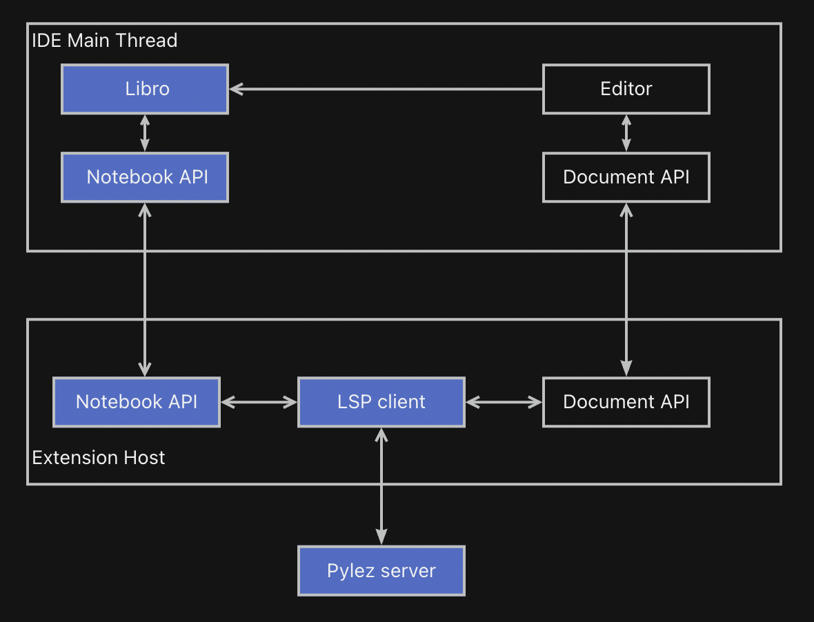

# @difizen/opensumi-module-libro

[](https://npmjs.org/package/@difizen/opensumi-module-libro)
[](https://npmjs.org/package/@difizen/opensumi-module-libro)

Use Libro as default notebook editor in Opensumi IDE





## Usage

see [opensumi-libro-demo](./example/src/browser/render-app.ts)

## Development

```bash
# install dependencies
$ npm install

# start server
$ npm run start:opensumi

# start demo, visit http://localhost:9000
$ npm run dev

```

## LICENSE

MIT
