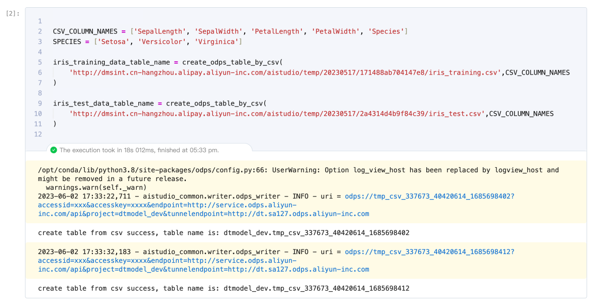
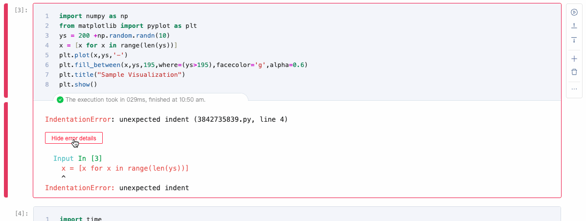
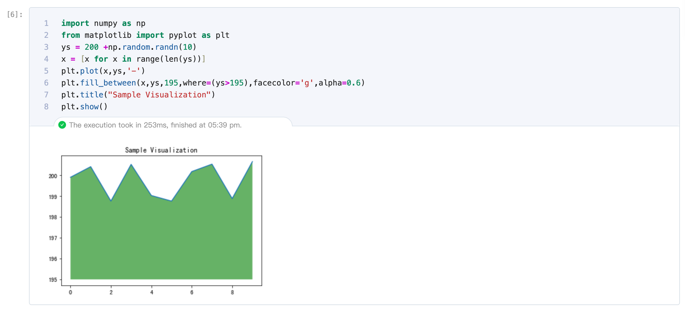

# libro-output

该包基于 [libro-core](../libro-core) 模块提供的输出扩展实现了 Jupyter 场景下的三个 Output 模块:
`StreamOutputModule`,`ErrorOutputModule`,`DisplayDataOutputModule`。同时，Output 中不同输出数据格式的渲染实现在 [libro-rendermime](../libro-rendermime/)。

## 标准输出

`StreamOutputModule` 模块主要功能是处理与显示代码执行的标准文本输出。

## 错误输出

`ErrorOutputModule` 模块主要功能是处理与显示执行错误类型的输出。对错误类型在 UI 交互上进行了更突出的设计，增加隐藏与显示详细错误信息的交互，避免大段的错误信息导致文件篇幅过长。

## 富文本输出

`DisplayDataOutputModule` 模块支持富文本格式输出的处理与显示。

